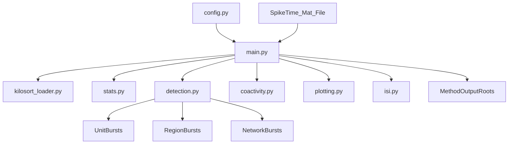

# Burst Detection Pipeline

Burst detection pipeline for spike-sorted data with a 3-stage cascade:

1. unit bursts, 2) region bursts, 3) network bursts.

The primary entrypoint is `BurstDetection/main.py`, with configuration in `BurstDetection/config.py`.

## What It Does

- Loads spike datasets from `SpikeTime_Mat_File` in `config.py`.
- Runs one detector family (`rankSurprise_toggle`, `maxisi_toggle`, or `alpha_meanisi_toggle`).
- Produces unit/region/network burst outputs, raster visualizations, and summary stats.
- Supports optional region-exclusion analysis (`RUN_REGION_EXCLUSION_STUDY`) inside the main run.
- Supports optional proxy panel and proxy-vs-FR correlation from a bilateral CSV (`PROXY_CSV` and related `PROXY_*` column settings).

## Repository Structure (Tracked Core)

```text
BurstDetection/
├── main.py                      # Main runner + CLI dataset selection
├── config.py                    # Central config (datasets, toggles, detector params, plotting)
├── run_datasets_parallel.ps1    # Windows helper for launching dataset batches
└── pipeline/
    ├── detection.py             # Unit/region/network burst detection logic
    ├── stats.py                 # Cluster stats, filtering, labels
    ├── coactivity.py            # Co-activity and firing-rate utilities
    ├── emg.py                   # EMG loading and preprocessing
    ├── isi.py                   # ISI analysis helpers
    ├── plotting.py              # Plotly raster/panel plotting
    ├── burst_paths.py           # Output path helpers
    ├── kilosort_loader.py       # Kilosort/Kilosortset loaders
    └── utils.py                 # Parsing, region inference, run-tag helpers
```

## Setup

Install dependencies in your active environment:

```bash
pip install numpy scipy pandas plotly matplotlib
```

If you maintain your own dependency lockfile, use that instead.

## Usage

From the repo root:

```bash
cd BurstDetection
python main.py
```

### Dataset Selection CLI

`main.py` supports filtering the configured dataset list:

- `--only-datasets "0,4,7"`: run by index from `SpikeTime_Mat_File`
- `--only-dataset-contains token`: substring filter (can repeat; AND semantics)
- `--only-dataset-kind {mat,kilosort,kilosortset}`: run only one dataset spec type

Examples:

```bash
python main.py --only-datasets "0,1"
python main.py --only-dataset-contains s522 --only-dataset-contains spikeTime_p3
python main.py --only-dataset-kind kilosortset
```

## Input Types

`SpikeTime_Mat_File` entries may be:

- plain `.mat` paths
- `kilosort:<dir>`
- `kilosortset:<dir1>;<dir2>;...`

`pipeline/kilosort_loader.py` handles Kilosort input parsing/loading.

## Outputs

Output roots are configured in `config.py` (for example `OUTPUT_ROOT_RS`, `OUTPUT_ROOT_MAXISI`, `OUTPUT_ROOT_ALPHA_MEANISI`), and run directories are tagged with the active parameter set.

See `config.py` for the definitive output root and plotting toggles.

## Configuration Notes

- Keep exactly one detector toggle enabled.
- Rank Surprise controls (including WIN-SHUFF and stage-1 segmentation) live together in `config.py`.
- Network validation controls include `MIN_UNIQUE_CHANNELS_NETWORK` and `MIN_UNIQUE_REGIONS_NETWORK`.
- Plot and proxy behavior are controlled by `PLOT_*`, `PLOT_PROXY_PANEL`, and `COMPUTE_PROXY_VS_FR`.
- Coactivity figures can show either EMG (`PLOT_EMG`) or fast-proxy traces (`PLOT_PROXY_PANEL`) in the lower panel.

## Architecture Appendix (Post-Cleanup)

### Active Entrypoints

- `BurstDetection/main.py`: primary pipeline entrypoint for dataset iteration, burst detection, outputs, and plotting.
- `BurstDetection/run_datasets_parallel.ps1`: Windows convenience launcher for running dataset batches.

### Runtime Data Flow




### Module Responsibilities

- `pipeline/detection.py`: 3-stage burst cascade and detector-specific logic (including RS controls).
- `pipeline/stats.py`: unit quality metrics, filtering, and label tables.
- `pipeline/coactivity.py`: co-activity and firing-rate binning utilities used by plots/analysis.
- `pipeline/plotting.py`: Plotly output figures (raster and related panels).
- `pipeline/burst_paths.py` + `pipeline/utils.py`: output path conventions, run tags, and region/electrode helpers.

### Practical Maintenance Rule

If you add a new analysis script, keep it decoupled from `main.py` unless it is required for default runs; this keeps the core pipeline stable and makes cleanup decisions straightforward.