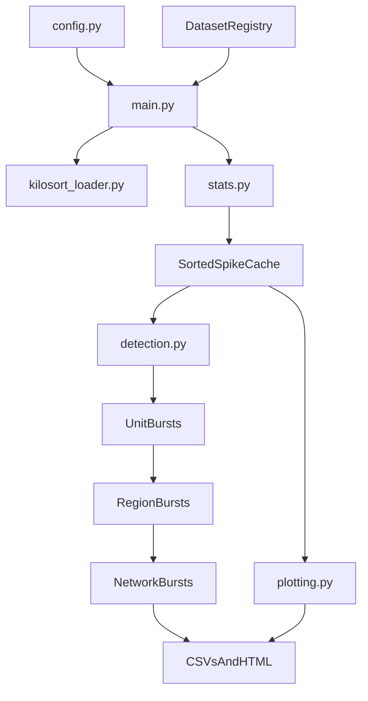

# RankSurprise SangerLab Burst Detection

Python pipeline for detecting bursts in spike-sorted recordings with a three-stage Rank Surprise cascade:

1. Unit bursts from each electrode/cluster
2. Region bursts from unit-burst onsets
3. Network bursts from region-filtered onsets

The entrypoint is `BurstDetection/main.py`; datasets, detection parameters, plotting, and output roots are configured in `BurstDetection/config.py`.

## Current Workflow

- Loads SangerLab MATLAB `spikeTime` structures, single Kilosort directories, or grouped Kilosort directory sets.
- Filters units using firing rate and, for MATLAB data, SNR.
- Runs deterministic Rank Surprise with WIN-SHUFF at Stage 1 and offset-based nulls at the region/network stages.
- Supports local Stage-1 segmentation for firing-rate drift. Current defaults use 5-second sliding windows, 40% overlap, and a 3-second stride.
- Writes cluster statistics, per-spike labels, unit/region/network burst CSVs, run parameters, and Plotly HTML rasters.
- Optionally adds EMG, bilateral proxy, firing-rate, and proxy-vs-firing-rate analysis.

The complete three-stage path is currently implemented for Rank Surprise. The `maxisi_toggle` and `alpha_meanisi_toggle` settings retain legacy detector code but do not populate the equivalent three-stage cascade.

## Repository Layout

```text
BurstDetection/
├── config.py                       # Datasets, parameters, output roots, plot toggles
├── main.py                         # Pipeline runner and dataset-selection CLI
├── run_datasets_parallel.ps1       # Windows helper for parallel dataset runs
├── pipeline/
│   ├── burst_paths.py              # Burst CSV naming conventions
│   ├── detection.py                # Unit/region/network Rank Surprise cascade
│   ├── emg.py                      # Optional EMG loading and preprocessing
│   ├── intervals.py                # Inclusive interval lookup and merging
│   ├── kilosort_loader.py          # Kilosort and Kilosort-set loading
│   ├── numeric.py                  # Shared numerical helpers
│   ├── plotting.py                 # Plotly raster and firing-rate panels
│   ├── stats.py                    # Cluster statistics and quality filtering
│   └── utils.py                    # Labels, regions, run tags, and spike caching
└── tests/
    ├── test_regression.py           # Sliding-window and helper regressions
    └── baselines/                   # End-to-end reference manifests
```

## Requirements

The code uses Python 3.10+ syntax and requires:

```powershell
pip install numpy scipy pandas plotly
```

The local project environment used for regression runs is named `bursts`:

```powershell
conda activate bursts
```

Patient data and the configured `H:\...` output/input locations are external to Git. Update `SpikeTime_Mat_File`, output roots, and optional proxy paths in `config.py` for another machine.

## Inputs

`SpikeTime_Mat_File` is the authoritative dataset registry. Entries support:

```python
"patient_data/s432/spikeTime_p2.mat"
r"kilosort:H:\path\to\imec0"
r"kilosortset:H:\path\to\imec0;H:\path\to\imec1"
```

- MATLAB files must contain the pipeline-compatible `spikeTime` structure.
- Kilosort directories require `spike_times.npy`, `spike_clusters.npy`, and `params.py`. Cluster labels and depth-related files are used when available.
- `kilosortset:` combines semicolon-separated directories into one run.
- `KILOSORT_MAX_DURATION_S` clips Kilosort input before analysis; it is currently 600 seconds.

## Running the Pipeline

From the repository root:

```powershell
cd BurstDetection
python main.py
```

Run a subset without editing the registry:

```powershell
# Comma-separated zero-based registry indices
python main.py --only-datasets "0,4,7"

# Repeated substring filters use AND semantics
python main.py --only-dataset-kind mat `
  --only-dataset-contains burstpaper_test `
  --only-dataset-contains drift

# One Kilosort probe
python main.py --only-dataset-kind kilosort `
  --only-dataset-contains M402_20240828S13 `
  --only-dataset-contains imec0
```

The available kinds are `mat`, `kilosort`, and `kilosortset`.

### Parallel Windows Runs

`run_datasets_parallel.ps1` opens one PowerShell window per job:

```powershell
.\run_datasets_parallel.ps1 -CondaEnv bursts -Indices 0,1,2

.\run_datasets_parallel.ps1 -CondaEnv bursts -Kind kilosort -ContainsJobs @(
    "M402_20240828S13,imec0",
    "M402_20240828S13,imec1"
)
```

## Important Configuration

- Keep exactly one of `rankSurprise_toggle`, `maxisi_toggle`, and `alpha_meanisi_toggle` enabled.
- `RS_ALPHA_SETS` controls Stage-1, region, and network alpha sweeps.
- `RS_STAGE1_LOCAL_SEGMENT_ENABLE`, `RS_STAGE1_SEGMENT_MODE`, `RS_STAGE1_SEGMENT_LEN_S`, and `RS_STAGE1_SEGMENT_OVERLAP_FRACTION` control local detection.
- Sliding windows preserve inclusive boundaries; overlapping detections are deduplicated and optionally merged post hoc.
- `RS_WIN_SHUFF_*` controls the deterministic Stage-1 reference ISIs. Automatic sizing is enabled by default.
- `MIN_UNIQUE_CHANNELS_REGION`, `MIN_UNIQUE_CHANNELS_NETWORK`, and `MIN_UNIQUE_REGIONS_NETWORK` enforce participation requirements.
- `FR_MIN_HZ`, `SNR_MIN`, and `SNR_MAX` control unit filtering. Kilosort can skip the pipeline SNR filter because this loader does not calculate SNR.
- `PLOT_SANGER_PRESENTATION_FIG`, `PLOT_FR`, `PLOT_EMG`, `PLOT_PROXY_PANEL`, and `PLOT_CORRELATION_GRAPH` control optional figures and panels.
- `firing_rate_bins_s` and `FIRING_RATE_OVERLAP_FRACTION` control population firing-rate bins.

## Outputs

Each run is written beneath its configured method root:

- `OUTPUT_ROOT_RS` for MATLAB Rank Surprise runs
- `OUTPUT_ROOT_RS_MOUSE` for Kilosort Rank Surprise runs
- Legacy method roots for maxISI and alpha-mean-ISI

The run directory name records the active alpha values, limits, quality thresholds, WIN-SHUFF settings, segmentation, and Kilosort duration cap.

```text
<output-root>/<dataset>/<period>/<run-tag>/
├── params.json
├── cluster_stats.csv
├── indiv_spike_labels.csv
├── burst_timings/
│   ├── unit_LR.csv
│   ├── unit_bursts_L.csv
│   ├── unit_bursts_R.csv
│   ├── region_LR.csv
│   ├── region_bursts_L.csv
│   ├── region_bursts_R.csv
│   ├── network_LR.csv
│   ├── network_bursts_L.csv
│   └── network_bursts_R.csv
└── raster_plots/
    ├── stage0_raw.html
    ├── stage1_unit_burst.html
    ├── stage2_region_burst.html
    ├── stage3_network_burst.html
    └── overview_region_burst.html
```

`indiv_spike_labels.csv` retains the legacy threshold-detector labeling behavior; the Rank Surprise Stage-1 source of truth is the unit burst CSVs.

## Testing and Regression Baselines

Run the regression suite with Python's standard-library unittest runner from `BurstDetection`:

```powershell
python -m unittest discover -s tests -v
```

The tests protect:

- Inclusive sliding-window boundaries
- Fixed-seed, changing-firing-rate Rank Surprise output
- Overlapping-window membership and merging
- Shared moving-average behavior

`tests/baselines/` records row counts and SHA-256 fingerprints for representative MATLAB and Kilosort runs. These manifests are used for end-to-end output comparisons; the external source datasets are not stored in Git.

## Runtime Data Flow

